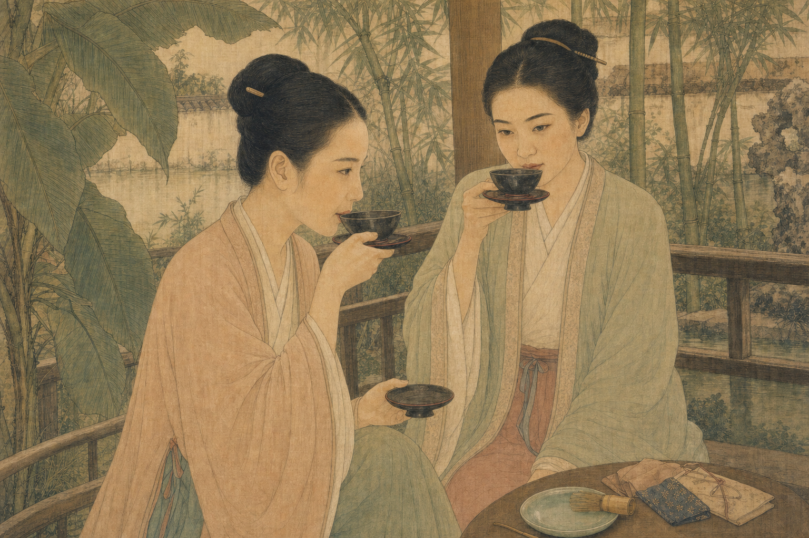
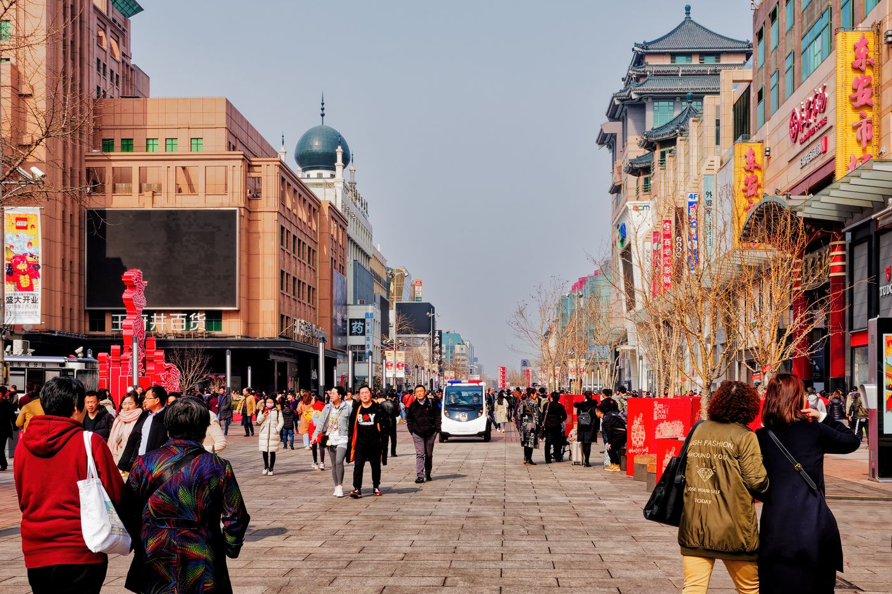
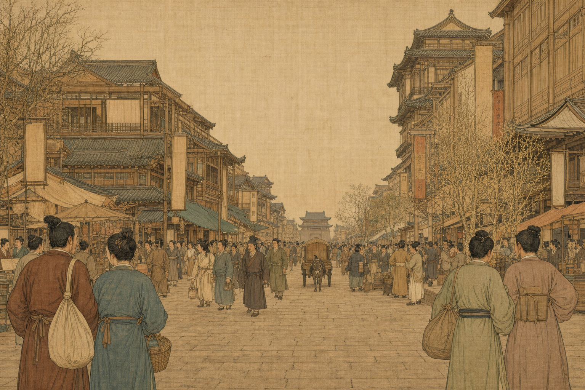

# 假装活在古代（pretend-ancient-life）

一个面向 Codex 的历史影像转换 Skill：把现代照片重构为具有明确朝代特征的中国历史场景，同时尽量保留人物身份、动作关系、构图、透视和光影。

它不只是给照片套一层“古风滤镜”。Skill 会先识别现代元素的功能，再根据目标朝代完成语义替换：咖啡杯可以变成茶盏，高架桥可以变成木构廊桥，办公桌可以变成文人书案；无法可靠判断的内容会保守处理，并在生成记录中注明。

## 效果预览

<table>
  <tr>
    <th colspan="2">现代咖啡聚会 → 宋代园林茶叙</th>
  </tr>
  <tr>
    <td width="50%"></td>
    <td width="50%"></td>
  </tr>
  <tr>
    <th>Before</th>
    <th>After</th>
  </tr>
</table>

<table>
  <tr>
    <th colspan="2">北京现代步行街 → 北宋汴京市集</th>
  </tr>
  <tr>
    <td width="50%"></td>
    <td width="50%"></td>
  </tr>
  <tr>
    <th>Before</th>
    <th>After</th>
  </tr>
</table>

## 特点

- **按时代路由**：不同朝代拥有独立参考资料、视觉词汇、禁用元素和权威来源。
- **按功能替换**：先判断物件、建筑和空间的用途，再寻找符合时代的对应物，而不是逐像素换皮。
- **保留原图叙事**：明确锁定人物数量、相对位置、姿态、视角、画幅和主光方向。
- **生成与审查一体化**：调用图片生成工具后，继续检查现代残留、时代错置、人物漂移和文字伪影。
- **过程可追溯**：每个示例同时保留原图、生成图、完整提示词、来源授权和历史简化说明。
- **支持 prompt-only**：也可以只输出可复用的结构化提示词，不生成图片。

## 已支持的时代

| 文化 | 时代 | 典型场景 | 视觉参考 |
|---|---|---|---|
| 中国 | 汉 | 宴饮、车马、庭院、驿路 | [汉代参考](references/china/han.md) |
| 中国 | 唐 | 长安市井、夜市、商旅、宴乐 | [唐代参考](references/china/tang.md) |
| 中国 | 宋 | 北宋市井、河港、书斋、园林、山水行旅 | [宋代参考](references/china/song.md) |
| 中国 | 元 | 草原骑行、多族群城市、农耕、文人山水 | [元代参考](references/china/yuan.md) |
| 中国 | 明 | 港口、江南城市、园林、商贸 | [明代参考](references/china/ming.md) |
| 中国 | 清 | 城市、驿站、行旅、宫廷纪实 | [清代参考](references/china/qing.md) |

外国历史时期仍在规划中。对于尚未建立参考资料的文化，Skill 不会直接套用中国古代视觉规则。

## 安装

Codex 会从 `$HOME/.agents/skills` 发现用户级 Skill。可以直接克隆本仓库：

```bash
mkdir -p "$HOME/.agents/skills"
git clone https://github.com/ChenZiHong-Gavin/pretend-ancient-life.git \
  "$HOME/.agents/skills/pretend-ancient-life"
```

如果已经有本地仓库，也可以创建符号链接，方便后续直接开发和更新：

```bash
mkdir -p "$HOME/.agents/skills"
ln -s /absolute/path/to/pretend-ancient-life \
  "$HOME/.agents/skills/pretend-ancient-life"
```

若只希望在单个项目中使用，可将仓库放入该项目的 `.agents/skills/pretend-ancient-life`。Codex 通常会自动发现新增或修改后的 Skill；如果没有出现，请重启 Codex。更多机制说明见 [OpenAI：Build skills](https://learn.chatgpt.com/docs/build-skills.md)。

## 快速开始

在 Codex 中附加一张照片，或提供本地图片路径，然后显式调用 Skill：

```text
使用 $pretend-ancient-life，把这张照片转换成北宋汴京市集。
保留人物数量、站位、镜头角度和光线，只替换不符合时代的元素。
```

也可以指定文件和输出形式：

```text
使用 $pretend-ancient-life，把 input/china/family.jpg 转成汉代宴饮图。
只生成 prompt，不生成图片。
```

生成图片与提示词默认分别保存到：

```text
output/images/china/<dynasty>/
output/prompts/china/<dynasty>/
```

## 工作原理

```text
确定文化与时代
    ↓
读取对应 reference，识别场景类型
    ↓
锁定人物、构图、透视、画幅与光影
    ↓
建立“现代元素 → 历史对应物”替换表
    ↓
生成图像或结构化 prompt
    ↓
检查现代残留、时代一致性与主体漂移
    ↓
保存结果、来源与必要的历史简化说明
```

如果用户只说“古代”而没有指定时代，Skill 会优先根据场景提供候选朝代；不能可靠判断时会请求选择，不会自行混合多个朝代的符号。

## 示例目录

每个示例都提供 `before`、`after` 和 `prompt.md` 三件套：

| 朝代 | 原图 | 生成图 | Prompt / 来源记录 |
|---|---|---|---|
| 汉 | [before](examples/china/han/before.jpg) | [after](examples/china/han/after.png) | [prompt](examples/china/han/prompt.md) |
| 唐 | [before](examples/china/tang/before.jpg) | [after](examples/china/tang/after.png) | [prompt](examples/china/tang/prompt.md) |
| 宋 | 6 组场景（见下表） | 6 组场景（见下表） | 6 份完整记录 |
| 元 | [before](examples/china/yuan/before.jpg) | [after](examples/china/yuan/after.png) | [prompt](examples/china/yuan/prompt.md) |
| 明 | [before](examples/china/ming/before.jpg) | [after](examples/china/ming/after.png) | [prompt](examples/china/ming/prompt.md) |
| 清 | [before](examples/china/qing/before.jpg) | [after](examples/china/qing/after.png) | [prompt](examples/china/qing/prompt.md) |

### 宋代多场景示例

| 场景 | 原图 | 生成图 | Prompt / 来源记录 |
|---|---|---|---|
| 城市高架街景 → 北宋市井 | [before](examples/china/song/urban-overpass/before.jpg) | [after](examples/china/song/urban-overpass/after.png) | [prompt](examples/china/song/urban-overpass/prompt.md) |
| 北京步行街 → 汴京市集 | [before](examples/china/song/market-street/before.jpg) | [after](examples/china/song/market-street/after.png) | [prompt](examples/china/song/market-street/prompt.md) |
| 现代咖啡聚会 → 园林茶叙 | [before](examples/china/song/tea-gathering/before.jpg) | [after](examples/china/song/tea-gathering/after.png) | [prompt](examples/china/song/tea-gathering/prompt.md) |
| 笔记本电脑办公 → 文人书斋 | [before](examples/china/song/scholar-studio/before.jpg) | [after](examples/china/song/scholar-studio/after.png) | [prompt](examples/china/song/scholar-studio/prompt.md) |
| 上海现代航运 → 汴河漕运 | [before](examples/china/song/river-port/before.jpg) | [after](examples/china/song/river-port/after.png) | [prompt](examples/china/song/river-port/prompt.md) |
| 雾山徒步 → 南宋山径行旅 | [before](examples/china/song/mountain-travel/before.jpg) | [after](examples/china/song/mountain-travel/after.png) | [prompt](examples/china/song/mountain-travel/prompt.md) |

单一示例的朝代直接存放三件套；同一朝代存在多个示例时，再增加场景目录：

```text
examples/china/han/
├── before.jpg
├── after.png
└── prompt.md

examples/china/song/tea-gathering/
├── before.jpg
├── after.png
└── prompt.md
```

`prompt.md` 同时记录图片来源、摄影者、授权、完整提示词、元素替换表与历史简化说明。仓库自带示例照片来自 Pexels，并按照 [Pexels License](https://www.pexels.com/license/) 使用和修改。

## 仓库结构

```text
SKILL.md                         核心路由、生成流程和验收规则
agents/openai.yaml               Codex Skill 界面元数据
references/index.md              支持范围与时代路由
references/china/<dynasty>.md    每个朝代的场景与视觉知识
references/_template.md          新时代参考模板
examples/china/<dynasty>/        按朝代组织的 before / after / prompt
input/                           用户输入照片（可选）
output/                          实际任务输出（默认被 Git 忽略）
assets/                          可复用参考素材
```

## 扩展一个新时代

1. 复制 `references/_template.md`，填写时间范围、场景路由、视觉特征、语义替换和禁用元素。
2. 补充博物馆、研究机构或原始图像等可核查来源，并区分史实、推断和创作性简化。
3. 在 `references/index.md` 中登记新条目。
4. 增加至少一个真实的 `before / after / prompt` 示例，记录原图来源与授权。
5. 检查现代残留、时代错置、人物漂移和路径完整性，再将该时代标为“已支持”。

欢迎通过 Issue 或 Pull Request 补充新时期、纠正史实错误，或改进生成提示词。

## 关于历史准确性

本项目生成的是基于资料约束的视觉重构，不等同于考古复原。服饰、器物、建筑和生活方式可能因地域、阶层、季节及具体年代而变化；参考文件会尽量记录证据来源与不确定性。若用于出版、展览或教学，请再由相关领域专家复核。
